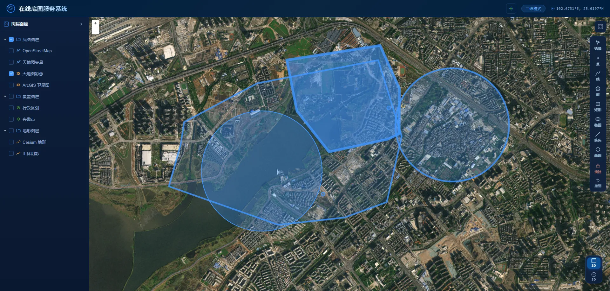

# 在线底图服务系统

> 这是一个Web项目，旨在打造全网最全在线底图整合系统。收集整理地球上所有的在线底图、标注、影像、矢量图层以及地形数据，构建二三维一体化应用。


## 技术框架
纯前端项目

使用 `Vue3+OpenLayers+Cesium` 进行构建


## 项目结构
```
basemap/
├── index.html                    # 入口 HTML
├── package.json                  # 依赖配置
├── package-lock.json
├── vite.config.js                # Vite 构建配置
├── README.md
├── .gitignore
│
├── public/
│   └── vite.svg
│
└── src/
    ├── main.js                   # Vue 应用入口
    ├── App.vue                   # 根组件（Header / 地图 / 图层面板 / 绘制工具栏）
    │
    ├── assets/
    │   └── styles.css            # 全局样式 + CSS 变量（科技蓝主题）
    │
    ├── components/
    │   ├── DrawingToolbar.vue    # 绘制工具栏（选择/画线/多边形/矩形/圆/箭头/样式面板）
    │   ├── LayerTree.vue         # 图层面板（树形结构/复选框/眼睛/拖拽排序）
    │   └── MapToggle.vue         # 2D/3D 切换按钮
    │
    ├── composables/
    │   ├── useMap2D.js           # OpenLayers 二维地图逻辑（初始化/底图/图层/绘制层）
    │   └── useMap3D.js           # Cesium 三维地图逻辑（初始化/相机/飞行动画）
    │
    ├── stores/
    │   └── mapStore.js           # Pinia 状态管理（地图模式/底图/中心/缩放/图层树/绘制状态）
    │
    └── config/
        └── layers.json           # 图层配置（底图分组 + 叠加图层分组）
```
## 项目效果
.png>) 

.png>) 

.png>) 

.png>) 


## 项目特点
- 二三维一体化应用
- 在线底图服务
- 个性化绘制和编辑

## 如何运行
`node` 版本要求22+

项目运行
```
npm install
npm run dev
```

项目打包
```
npm run build
```


## 联系作者
微信公众号：GIS之路

个人微信：`shanhaigis`


